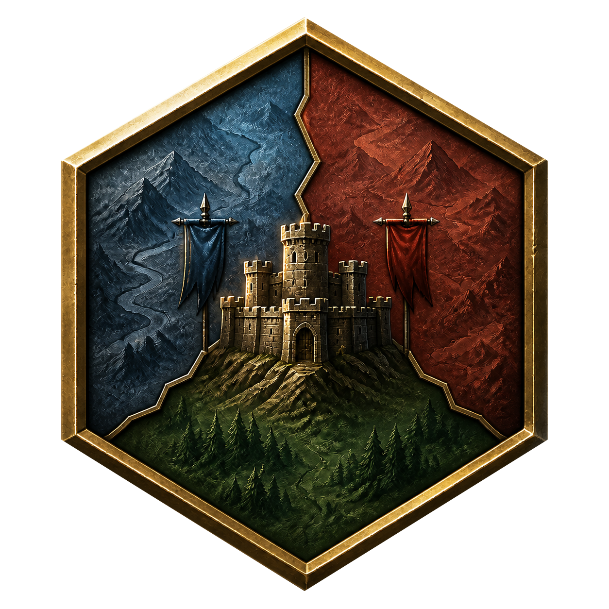

<p align="center">
  
</p>

<h1 align="center">min2world</h1>

React와 TypeScript를 학습하며 만드는 싱글 플레이 웹 턴제 전략 시뮬레이션 게임입니다.

시작 화면에서 맵 크기·지도 종류·내 세력을 고른 뒤, 무작위 육각 지도에서 부대를 이동하고 전투하며 상대 수도를 점령해 승리합니다. City에서 군사 유닛과 개척자·건설자를 생산하고, 정착·거점 건설·내정 건설과 병력 유지비를 함께 고려해 세력을 확장합니다. AI도 같은 경제·생산·건설·전투 규칙으로 행동합니다. 플레이어 턴은 브라우저에 저장해 이어서 플레이할 수 있습니다.

## 개발 환경

- Node.js 22.12 이상
- npm

## 실행

```bash
npm install
npm run dev
```

개발 서버가 출력한 로컬 주소를 브라우저에서 엽니다.

- `?mode=quick`: 2인용 빠른대전 즉시 시작
- `?mode=standard`: 시작 설정 화면과 전체 기능

## 검증

```bash
npm test
npm run lint
npm run build
npm run verify
```

테스트를 수정하면서 계속 실행하려면 `npm run test:watch`를 사용합니다.

## 배포

Cloudflare 로그인과 권한 설정을 마친 환경에서 다음 명령을 사용합니다.

```bash
npm run deploy:preview
npm run deploy
```

두 명령 모두 프로덕션 빌드를 먼저 만들며, 각각 새 버전 업로드와 실제 배포를 수행합니다.

하나의 Worker가 `min2world.dev`의 빠른대전과 `beta.min2world.dev`의 전체모드를 함께 제공합니다. Cloudflare Builds는 GitHub 저장소와 연결해 production branch를 `main`, build command를 `npm run verify`, deploy command를 `npx wrangler deploy`, non-production deploy command를 `npx wrangler versions upload`로 설정합니다.

## 맵 크기

| 구분 | 크기 | 비고 |
| --- | --- | --- |
| 2인용 | 15 × 11 | 2세력 듀얼 전용 |
| 초소형 | 21 × 15 | 현재 2세력 지원 |
| 소형 | 29 × 21 | 현재 2세력 지원 |
| 중형 | 41 × 29 | 현재 2세력 지원 |

세력 수는 현재 2개로 고정되어 있습니다.
2인용 15 × 11 지도는 화면 중앙 열이 강으로 막혀 있으며, 위에서 네 번째와 여덟 번째 행의 다리 두 곳으로만 강을 건널 수 있습니다. 다리와 좌우 접근 타일에는 거점과 시작 유닛이 배치되지 않습니다.
새 지도에는 세력별 중립 농장·광산·대장간이 하나씩 배치되며, 중립 Village와 Outpost는 생성하지 않습니다.

## 조작 방법

1. 시작 화면에서 맵 크기, 지도 종류, 내 세력을 정한 뒤 게임을 시작합니다. 세력 수는 현재 2개로 고정되어 있습니다.
2. 내 세력 유닛을 좌클릭해 선택합니다.
3. 금색으로 표시된 이동 가능 칸을 **우클릭**해 이동합니다. 이동 비용만큼 이동력이 차감되며, 남은 이동력으로 계속 이동할 수 있습니다.
4. 붉은 표시가 된 적 유닛이나 군사 거점을 좌클릭해 공격합니다. 궁병은 육각 거리 2까지 공격하며, 유닛 전투는 돌진·피해·반격과 제거 결과가 순서대로 표시됩니다. 군사 거점 공성에서는 거점이 반격하지 않습니다.
5. 사선으로 표시된 적 통제 구역에 남은 이동력을 가지고 진입하면 추가 이동은 멈추지만 인접한 적은 공격할 수 있습니다. 소유된 군사 거점은 전체 footprint 주변에 통제 구역을 만들고, 중립 거점은 만들지 않습니다. 진입까지 이동력을 모두 사용했다면 공격할 수 없습니다.
6. 선택된 정보가 없을 때 지도 타일에 마우스를 올리면 사이드바에 유닛·거점·지형 정보가 미리 표시됩니다. 일반 모드에서 빈 타일이나 적 유닛을 좌클릭하면 해당 정보를 사이드바에 고정합니다.
7. 거점을 좌클릭하면 거점 정보창이 열립니다. 소유 거점의 `발전` 탭에서 비용과 다음 효과를 확인해 발전할 수 있습니다. 생산 탭은 모든 유닛을 생산하는 City에만 표시되며, City의 `건설` 탭에서는 곡창·시장·성벽·병영·선술집·신전·도서관을 건설하거나 진행 중인 건설을 취소할 수 있습니다. 도시당 건설 대기열은 하나이며 취소해도 자원은 환불되지 않습니다.
8. 유닛을 선택하면 성 정보창과 같은 스타일의 부대 정보창이 열립니다. 개척자는 `정착`으로 현재 칸에 Village를 세우면서 소모되고, 건설자는 비용을 내고 Outpost·Farm·Mine·Blacksmith를 세운 뒤에도 유지됩니다. 활성 플레이어 턴에는 `해산`으로 부대를 즉시 제거할 수 있으며 자원은 환불되지 않습니다.
9. 상태바에는 자원과 순수입이 표시됩니다. 순수입을 클릭하면 수입·유지비·예약 유지비 상세를 확인할 수 있습니다. 플레이어 유닛의 행동을 마치면 `턴 종료`를 선택하거나 `Enter`를 누르며 생산 배치나 정착·건설 확인 중에는 `Esc`로 취소합니다.
10. 지도는 드래그로 팬하고, 마우스 휠이나 핀치로 확대·축소할 수 있습니다. 모바일에서는 `맞춤`으로 전체 지도를 맞추고, 우상단 버튼으로 미니맵을 열며, 하단 선택 정보 시트를 펼쳐 명령을 실행합니다.
11. AI는 유지비가 수입보다 많으면 다른 행동보다 먼저 병력을 하나씩 해산해 적자를 해소합니다. 이후 사거리 안의 플레이어 유닛을 우선 공격하고, 공격할 수 없으면 목표를 향해 이동합니다. 모든 부대가 행동한 뒤 다음 유지비 예약액을 남길 수 있으면 거점 발전·City 건설·부대 생산을 차례로 판단합니다.
12. 상대 세력의 모든 수도(성)를 점령하면 승리하고, 내 수도를 잃으면 패배합니다.
13. 상단 `새 게임`에서 새로운 무작위 지도로 새 판을 시작합니다. `저장`·`범례`·`도움말`도 같은 상단 메뉴에서 엽니다.

평지와 오아시스 이동 비용은 1, 사막·사막 언덕·툰드라·툰드라 숲·언덕·숲은 2입니다. 오아시스는 덥고 건조한 평지의 5%를 후보로 삼고, 인접한 육각 6칸이 모두 사막 또는 사막 언덕이며 다른 오아시스와 인접하지 않은 곳에만 생성됩니다. 산·툰드라 산·물은 통과할 수 없습니다. 언덕·사막 언덕·숲·툰드라 숲은 전투력 보정 +3입니다. 일반 숲은 연결된 군락마다 활엽수 또는 침엽수 변형을 사용합니다. 적 유닛의 육각 인접 6칸은 통제 구역이며 이동 경로가 이를 관통할 수 없습니다. 보병은 표준 근접 병종, 기병은 고속 공격 병종, 궁병은 사거리 2의 원거리 병종, 창병은 대기병 보너스를 가진 병종입니다. 공격하면 해당 유닛의 남은 이동력을 모두 사용합니다. 군사 거점의 HP가 0이 되면 즉시 공격 세력이 점령하고 최대 HP의 50%를 회복합니다. `Outpost → Keep → Stronghold` 발전은 현재 HP 비율을 유지하며, `Town → City`는 최대 HP로 시작합니다. 세력 턴을 종료하면 `max(0, 현재 자원 + 수입 - 유지비)`로 정산합니다. 생산·발전·건설은 행동 후 예상 경제에서 다음 적자분을 감당할 자원을 남겨야 합니다.

건설자가 세운 Farm·Mine·Blacksmith는 통행 가능한 육지 그래프 거리 3 이내에서 가장 가까운 아군 Town·City의 지원을 받습니다. 맵에서 생성된 중립 생산 거점은 점령 후에도 도시 생산 거점 한도에서 제외됩니다. Town은 건설 생산 거점 2개, City는 4개까지 지원하며 같은 거리에서는 거점 ID 오름차순으로 귀속됩니다. Village와 군사 거점은 생산 거점을 지원하지 않습니다. 점령이나 발전으로 한도를 초과해도 기존 생산 거점은 유지되고 새 생산 거점 건설만 차단됩니다. City 외곽 지구를 통한 한도 확장은 아직 구현되지 않았습니다.

| 병종 | 유지비/턴 |
| --- | ---: |
| 보병 | 1 |
| 창병 | 1 |
| 궁병 | 1 |
| 기병 | 2 |
| 개척자 | 1 |
| 건설자 | 1 |

| 요새화 거점 | 최대 HP | 방어력 |
| --- | ---: | ---: |
| Outpost | 50 | 35 |
| Keep | 75 | 42 |
| Stronghold | 100 | 50 |
| City | 120 | 55 |

| 거점 | 수입 | 생산 |
| --- | ---: | --- |
| Outpost / Keep / Stronghold | 0 / 0 / 0 | 불가 |
| Village / Town / City | 3 / 5 / 7 | City에서 모든 유닛 생산 |
| Farm Lv.1~3 | 2 / 3 / 4 | 불가 |
| Mine Lv.1~3 | 3 / 4 / 5 | 불가 |
| Blacksmith Lv.1~3 | 2 / 3 / 4 | 불가, City의 군사 유닛 생산비 할인 |

## 저장 데이터

- 게임은 현재 컴퓨터와 브라우저의 `localStorage`에 모드별 단일 슬롯으로 저장됩니다. 빠른대전은 기존 전체모드 저장을 덮어쓰지 않습니다.
- 현재 스키마는 16입니다. 스키마 6부터 연쇄 마이그레이션하며 스키마 14에는 난이도, 스키마 15에는 `standard` 게임 모드를 채웁니다. 스키마 8 저장에 `mapType`이 없으면 `balanced`로 처리하고, 스키마 9 군사 거점은 종류별 최대 HP로 채웁니다. 마이그레이션 중 기존 맵 생성 버전은 유지하며 새 지도는 버전 25를 사용합니다. 지도 생성 버전 5~23과 현재 버전 25를 지원하고, 사각 지도 기반 스키마 4·5는 불러오지 않습니다.
- 수입·유지비·순수입·예약액은 현재 거점·건물·유닛에서 계산하는 파생 정보이므로 별도 저장하지 않습니다.
- 플레이어 턴에서만 저장할 수 있으며 AI 행동이나 전투 중에는 저장·불러오기가 잠깁니다.
- 앱을 다시 열어도 저장은 자동 적용되지 않으며 `불러오기`를 직접 선택해야 합니다.
- 다른 컴퓨터·브라우저·배포 주소와 동기화되지 않습니다.
- 브라우저 사이트 데이터를 삭제하거나 시크릿 모드를 종료하면 저장이 사라질 수 있습니다.

`src/assets/terrain/cmartins/`의 지형 타일은 cmartins.art의 [Hex Tiles: Fantasy](https://cmartins.itch.io/hex-tiles-fantasy)를 기반으로 편집·변형했으며 [CC BY-SA 4.0](https://creativecommons.org/licenses/by-sa/4.0/)으로 제공합니다. 다리·물 지형과 거점 래스터 이미지는 프로젝트용으로 별도 제작한 자산입니다. 자세한 적용 범위와 변경 사항은 [제3자 에셋 고지](THIRD_PARTY_NOTICES.md), 아직 코드에 연결하지 않은 에셋은 [에셋 안내](src/assets/README.md)에 정리했습니다.

전체 방향은 [개발 계획](docs/min2world.md), 단계별 진행 상황과 상세 명세는 [개발 마일스톤](docs/milestones/README.md)을 참고하세요.
